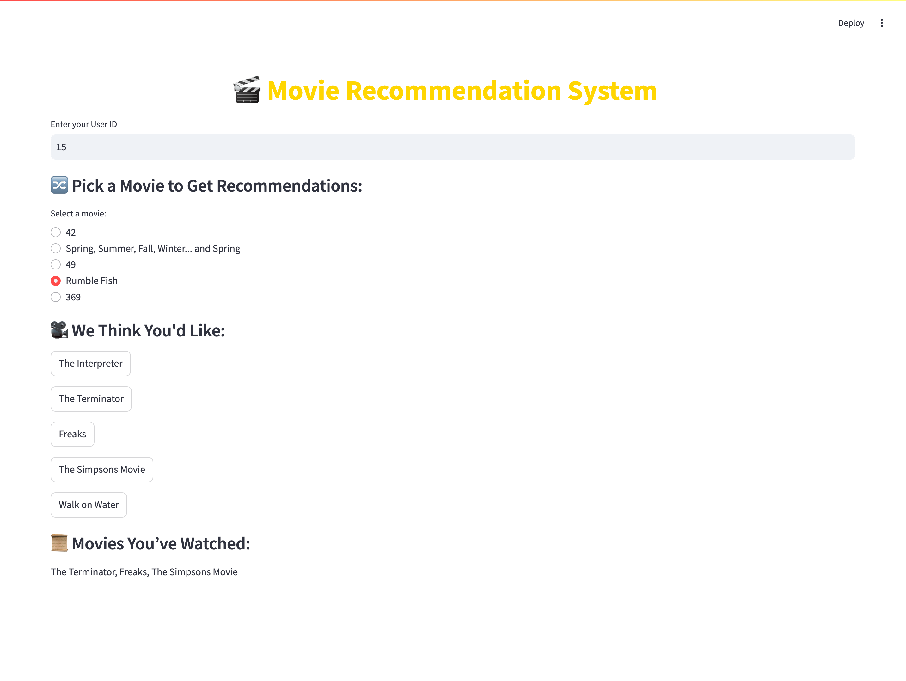

# 🎬 Movie Recommendation System

---

## 📊 **Project Overview**

This project focuses on building a **hybrid movie recommendation system** that suggests movies based on **user behavior, movie content similarity, and popularity trends**. The system leverages **machine learning models** to provide accurate and **personalized movie recommendations**.

The solution is deployed as a **Flask API** and integrated with a **Streamlit-based user interface**, making it easy for users to interact with the system and explore recommendations dynamically.

___

## 🔍 **Key Findings**

### 1️⃣ **Recommendation System Performance**
- The **hybrid approach** combining **collaborative filtering, content-based filtering, and popularity filtering** provided the most **balanced recommendations**.
- **Collaborative Filtering (User & Item-Based):** Achieved **strong personalization** by learning from user preferences.
- **Content-Based Filtering:** Successfully recommended movies based on **genre, storyline, and themes**.
- **Popularity-Based Filtering:** Suggested **trending movies** based on rating and watch frequency.

### 2️⃣ **Hybrid Model Effectiveness**
- The **Mean Reciprocal Rank (MRR)** showed that the hybrid model **significantly improves ranking quality** over individual filtering models.
- The **Precision@10 and Recall@10** metrics confirmed that the recommendations **aligned well with user interests**.
- The **Root Mean Squared Error (RMSE)** for **collaborative filtering** indicated the need for further fine-tuning.

### 3️⃣ **User Engagement Insights**
- Users preferred **movies that closely matched their prior selections**, reinforcing the **effectiveness of content-based filtering**.
- The **most-watched genres and highest-rated movies** were aligned with popular recommendations, validating the **popularity-based approach**.

### 4️⃣ **Key Challenges**
- **Large Dataset Processing:** Initial implementation faced **high memory usage** due to the size of the **ratings dataset**, requiring **data sampling**.
- **Cold Start Problem:** New users with no history posed a challenge, which was mitigated using **popularity-based recommendations**.

---

## ✅ **Conclusion**

The **Movie Recommendation System** successfully delivers **personalized and relevant movie suggestions** using a combination of **machine learning techniques**. By integrating **multiple recommendation models**, the system ensures that **users receive high-quality movie suggestions** based on their preferences, past interactions, and trending choices.

This system can be **easily extended** to incorporate **real-time user feedback**, improve model accuracy with **deep learning**, and scale for **large-scale production deployment**.

---

### 🛠 **Technologies Used**
- **Python**: pandas, numpy, scikit-learn, flask, requests, streamlit
- **Machine Learning**: Collaborative Filtering (Matrix Factorization), Content-Based Filtering, Popularity-Based Ranking
- **Data Processing**: Preprocessing, Feature Engineering, Exploratory Data Analysis (EDA)
- **Visualization**: Seaborn, Matplotlib
- **API & Frontend**: Flask REST API, Streamlit UI
